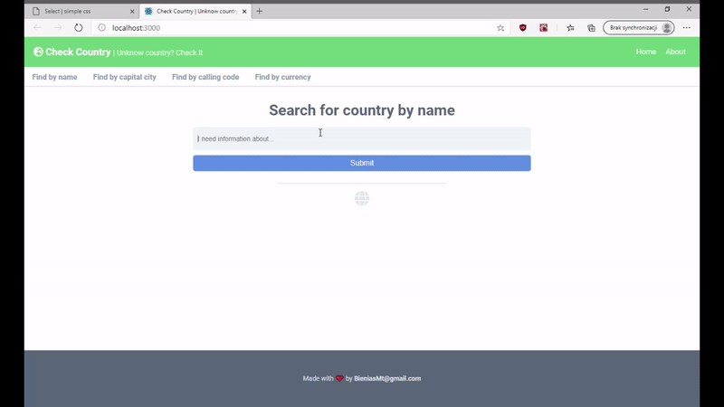

# Check Country App
Everything about the countries of our globe

## Main features are looking for country by its:
- calling code
- currency
- capital city

You can also:
- get wider information about specific country

## Tech stack:
* [Siimple css](https://docs.siimple.xyz/) - CSS Toolkit
* [ReactJS](https://reactjs.org/) - Javascript framework
* [Axios](https://github.com/axios/axios) - Fetching data from API

## REST Countries
[REST Countries](https://restcountries.eu/#rest-countries) is a Free API that provides information from all countries around the world
